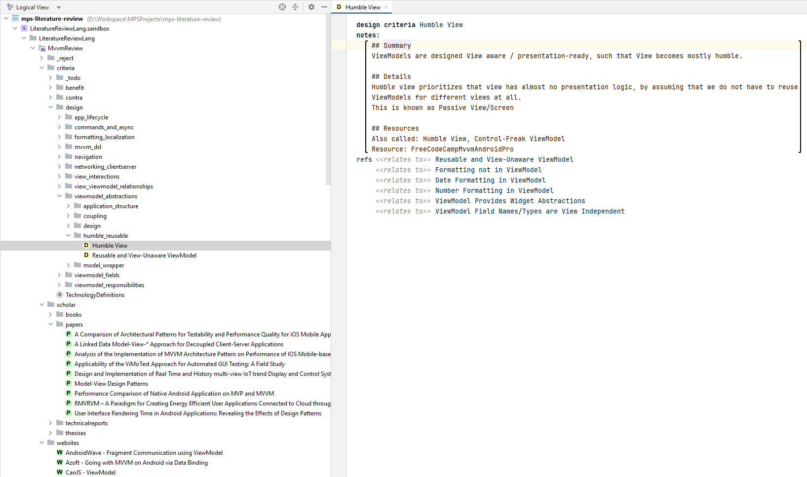

# MPS Literature Review Language

This repository contains a language for multi-vocal literature review classification schemes.

It also contains a concrete model `MvvmReview` for classifying MVVM design constructs and trade-offs.

## Setup

* install JetBrains MPS 2023.2
  * see https://www.jetbrains.com/mps/download/previous.html#version20232
* start MPS and open the project
* run `Make Project` (e.g., under menu `Build`)
  * note: if generation is blocked, wait until indexing is finished
* "Checking models" will be processed with errors (since the language definition is not built yet): simply click on "Ignore Errors" or build the "LiteratureReviewLang" separately
* after make finishes without errors, you can find the meta-model/language-definition under `LiteratureReviewLang`, and the MVVM Classification under `LiteratureReviewLang.sandbox`

## MVVM Classification

* you will find the `MvvmReview` model (classification scheme) under the solution `languages/LiteratureReviewLang.sandbox`
* generated sources (whenever Make is processed on the model) are placed under `languages/LiteratureReviewLang.sandbox/source_gen`
